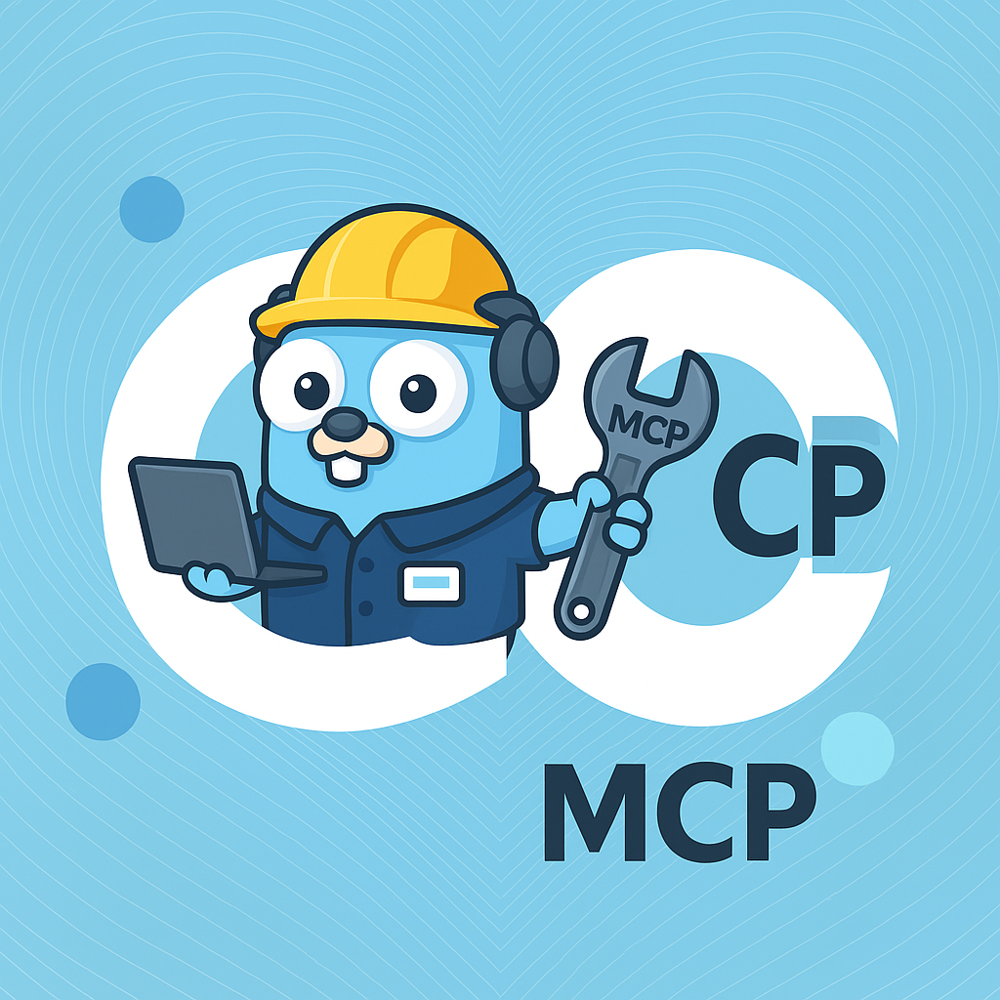

# Go-MCP

<div align="center">

</div>
<br/>

<p align="center">
  <a href="https://github.com/ThinkInAIXYZ/go-mcp/releases"></a>
  <a href="https://github.com/ThinkInAIXYZ/go-mcp/stargazers"></a>
  <a href="https://github.com/ThinkInAIXYZ/go-mcp/network/members"></a>
  <a href="https://github.com/ThinkInAIXYZ/go-mcp/issues"></a>
  <a href="https://github.com/ThinkInAIXYZ/go-mcp/pulls"></a>
  <a href="https://github.com/ThinkInAIXYZ/go-mcp/blob/main/LICENSE"></a>
  <a href="https://github.com/ThinkInAIXYZ/go-mcp/graphs/contributors"></a>
  <a href="https://github.com/ThinkInAIXYZ/go-mcp/commits"></a>
</p>
<p align="center">
  <a href="https://pkg.go.dev/github.com/ThinkInAIXYZ/go-mcp"></a>
  <a href="https://goreportcard.com/report/github.com/ThinkInAIXYZ/go-mcp"></a>
  <a href="https://github.com/ThinkInAIXYZ/go-mcp/actions"></a>
</p>

<p align="center">
  <a href="README.md">English</a>
</p>

## 🚀 概述

Go-MCP 是一个强大的 Go 语言版本的 MCP SDK，实现 Model Context Protocol (MCP)，协助外部系统与 AI 应用之间的无缝通信。基于 Go 语言的强类型和性能优势，它提供了简洁、符合习惯的 API，方便您将外部系统集成到 AI 应用程序中。

### ✨ 核心特性

- 🔄 **完整协议实现**：全面实现 MCP 规范，确保与所有兼容服务无缝对接
- 🏗️ **优雅的架构设计**：采用清晰的三层架构，支持双向通信，保证代码的模块化、可扩展性
- 🔌 **与三方Web框架无缝集成**：通过提供实现 MCP 协议的 http.Handler，允许开发者将 MCP 集成入自己的服务框架
- 🛡️ **类型安全**：基于 Go 的强类型系统，保证代码清晰、高度可维护
- 📦 **简单部署**：得益于 Go 的静态编译特性，无需进行复杂的依赖管理
- ⚡ **高性能设计**：充分利用 Go 的并发能力，在各类场景下都能保持出色的性能和较低的资源开销

## 🛠️ 安装

```bash
go get github.com/ThinkInAIXYZ/go-mcp
```

需要 Go 1.18 或更高版本。

## 🎯 快速开始

### 客户端示例

```go
package main

import (
	"context"
	"log"

	"github.com/ThinkInAIXYZ/go-mcp/client"
	"github.com/ThinkInAIXYZ/go-mcp/transport"
)

func main() {
	// 创建 SSE 传输客户端
	transportClient, err := transport.NewSSEClientTransport("http://127.0.0.1:8080/sse")
	if err != nil {
		log.Fatalf("创建传输客户端失败: %v", err)
	}

	// 初始化 MCP 客户端
	mcpClient, err := client.NewClient(transportClient)
	if err != nil {
		log.Fatalf("创建 MCP 客户端失败: %v", err)
	}
	defer mcpClient.Close()

	// 获取可用工具列表
	tools, err := mcpClient.ListTools(context.Background())
	if err != nil {
		log.Fatalf("获取工具列表失败: %v", err)
	}
	log.Printf("可用工具: %+v", tools)
}

```

### 服务器示例

```go
package main

import (
	"fmt"
	"log"
	"time"

	"github.com/ThinkInAIXYZ/go-mcp/protocol"
	"github.com/ThinkInAIXYZ/go-mcp/server"
	"github.com/ThinkInAIXYZ/go-mcp/transport"
)

type TimeRequest struct {
	Timezone string `json:"timezone" description:"时区" required:"true"` // 使用 field tag 描述 inputschema
}

func main() {
	// 创建 SSE 传输服务器
	transportServer, err := transport.NewSSEServerTransport("127.0.0.1:8080")
	if err != nil {
		log.Fatalf("创建传输服务器失败: %v", err)
	}

	// 初始化 MCP 服务器
	mcpServer, err := server.NewServer(transportServer)
	if err != nil {
		log.Fatalf("创建 MCP 服务器失败: %v", err)
	}

	// 注册时间查询工具
	tool, err := protocol.NewTool("current time", "获取指定时区的当前时间", TimeRequest{})
	if err != nil {
		log.Fatalf("创建工具失败: %v", err)
		return
	}
	mcpServer.RegisterTool(tool, handleTimeRequest)

	// 启动服务器
	if err = mcpServer.Run(); err != nil {
		log.Fatalf("服务器运行失败: %v", err)
	}
}

func handleTimeRequest(req *protocol.CallToolRequest) (*protocol.CallToolResult, error) {
	var timeReq TimeRequest
	if err := protocol.VerifyAndUnmarshal(req.RawArguments, &timeReq); err != nil {
		return nil, err
	}

	loc, err := time.LoadLocation(timeReq.Timezone)
	if err != nil {
		return nil, fmt.Errorf("无效的时区: %v", err)
	}

	return &protocol.CallToolResult{
		Content: []protocol.Content{
			protocol.TextContent{
				Type: "text",
				Text: time.Now().In(loc).String(),
			},
		},
	}, nil
}
```

## 🏗️ 架构设计

Go-MCP 采用优雅的三层架构设计：


1. **传输层**：负责底层通信实现，支持多种传输协议
2. **协议层**：处理 MCP 协议的编解码和数据结构定义
3. **用户层**：提供友好的客户端和服务器 API

目前支持的传输方式：


- **HTTP SSE/POST**：基于 HTTP 的服务器推送和客户端请求，适用于 Web 场景
- **Stdio**：基于进程标准输入输出流，适用于本地进程间通信

传输层采用统一的接口抽象，使得新增传输方式（如 Streamable HTTP、WebSocket、gRPC）变得简单直接，且不影响上层代码。

## 🤝 参与贡献

我们欢迎各种形式的贡献！详情请参阅 [CONTRIBUTING.md](CONTRIBUTING.md)。

## 📄 开源协议

本项目采用 MIT 协议 - 详见 [LICENSE](LICENSE) 文件

## 📞 联系我们

- **GitHub Issues**：[提交问题](https://github.com/ThinkInAIXYZ/go-mcp/issues)
- **Discord**：点击[链接](https://discord.gg/4CSU8HYt)加入我们的用户群
- **微信群**：


## ✨ 贡献者

感谢所有为项目做出贡献的开发者！

<a href="https://github.com/ThinkInAIXYZ/go-mcp/graphs/contributors">
  
</a>

## 📈 项目趋势

[](https://www.star-history.com/#ThinkInAIXYZ/go-mcp&Date)
