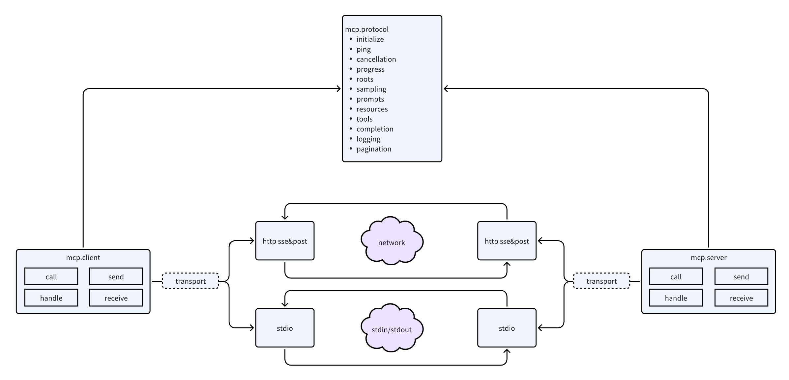
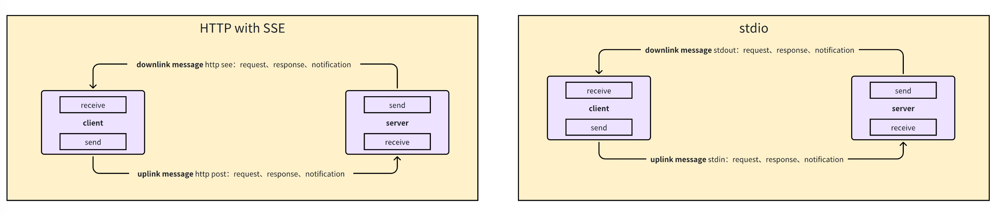

# Go-MCP


<p align="center">
  <a href="https://pkg.go.dev/github.com/ThinkInAIXYZ/go-mcp"></a>
  <a href="https://goreportcard.com/report/github.com/ThinkInAIXYZ/go-mcp"></a>
  <a href="https://github.com/ThinkInAIXYZ/go-mcp/blob/main/LICENSE"></a>
  <a href="https://github.com/ThinkInAIXYZ/go-mcp/releases"></a>
</p>

## 📖 概述

Go-MCP 是一个功能强大且易于使用的 Go 客户端库，专为与 Model Context Protocol (MCP) 进行交互而设计。该 SDK 提供了完整的 API 覆盖，包括资源管理、配置、监控和自动化操作等核心功能。

MCP (Model Context Protocol) 是一种标准化的 AI 模型交互协议，使应用程序和 AI 模型之间能够无缝通信。在当今快速发展的 AI 领域，标准化的通信协议变得尤为重要，它能够确保不同系统和组件之间的互操作性，降低集成成本，并提高开发效率。Go-MCP 通过简洁、符合习惯的 API 将这种能力带入 Go 应用程序，使开发者能够轻松地将 AI 功能集成到他们的 Go 项目中。

Go 语言以其卓越的性能、简洁的语法和强大的并发支持而闻名，特别适合构建高性能的网络服务和系统工具。通过 Go-MCP，开发者可以充分利用 Go 语言的这些优势，同时享受 MCP 协议带来的标准化和互操作性好处。无论是构建边缘 AI 应用、微服务架构还是企业级系统，Go-MCP 都能提供可靠、高效的解决方案。

### 核心特性

- **核心的协议实现**：Go-MCP 全面支持 MCP 规范，确保与所有兼容的 MCP 服务和客户端的无缝交互。SDK 实现了协议中定义的所有核心方法和通知机制，包括初始化、工具调用、资源管理、提示处理等功能。

- **多种传输方式**：支持 SSE (Server-Sent Events) 和 stdio 传输，适应不同的应用场景和部署环境。SSE 传输适用于基于 Web 的应用程序，提供实时的服务器推送能力；而 stdio 传输则适用于进程间通信和命令行工具，使 MCP 功能可以轻松集成到各种系统中。

- **丰富的通知系统**：全面的事件处理机制，支持实时更新和状态变化通知。通过注册自定义通知处理器，应用程序可以实时响应工具列表变更、资源更新、提示列表变化等事件，实现动态和交互式的用户体验。

- **灵活的架构**：易于扩展，支持自定义实现和定制化需求。Go-MCP 的模块化设计使开发者可以根据自己的需求扩展或替换特定组件，同时保持与核心协议的兼容性。

- **生产就绪**：经过全面测试和性能优化，适用于生产环境的高要求。SDK 采用了 Go 语言的最佳实践，包括并发控制、错误处理和资源管理，确保在高负载情况下的稳定性和可靠性。

- **详尽的文档和示例**：提供全面的文档和丰富的示例代码，帮助开发者快速上手和深入理解。无论是初学者还是有经验的 Go 开发者，都能通过文档和示例轻松掌握 SDK 的使用方法。

### 为什么选择 Go-MCP 及其未来前景

Go-MCP SDK 在当前技术环境中具有显著的优势，并且在未来有广阔的发展前景。以下是核心优势：

1. **本地部署优势**：Go-MCP 支持本地 AI 应用部署，提供更快的响应时间、更好的成本效益、更强的数据控制能力，以及更灵活的定制化选项。Go 语言的静态编译特性使得部署极其简单，无需管理复杂的依赖关系。

2. **边缘计算支持**：特别适合在资源受限的边缘设备上运行 AI 模型，支持实时处理、低带宽环境、离线操作，并保护数据隐私。Go 语言的高性能和低内存占用特性使其成为边缘计算的理想选择。

3. **微服务架构适配**：完美契合现代微服务和无服务器架构，支持 AI 微服务封装、事件驱动处理、分布式 AI 系统，以及混合云部署。Go 的轻量级运行时和并发模型特别适合处理大量并发请求。

4. **强大的生态系统**：受益于 Go 语言的活跃社区和企业支持，提供丰富的库和框架，以及优秀的开发工具链。随着社区发展，SDK 的功能和性能将持续提升。

5. **数据安全保护**：支持本地数据处理，减少数据传输需求，降低数据泄露风险。提供安全的通信方式，可与加密和认证机制集成，满足数据主权和法规遵从要求。

6. **跨平台兼容性**：支持所有主流操作系统和处理器架构，提供一致的行为和简单的部署方式。通过静态链接和交叉编译支持，确保在不同平台上的统一体验。

## 🚀 安装

安装 Go-MCP SDK 非常简单，只需使用 Go 的标准包管理工具 `go get` 命令：

```bash
go get github.com/ThinkInAIXYZ/go-mcp
```

这将下载并安装 SDK 及其所有依赖项。Go-MCP 要求 Go 1.18 或更高版本，以确保对最新语言特性和标准库的支持。


## 🔍 快速开始

### 客户端实现

以下是一个基本的客户端实现示例，展示了如何创建 MCP 客户端、连接到服务器并执行基本操作：

```go
package main

import (
	"context"
	"fmt"
	"log"

	"github.com/ThinkInAIXYZ/go-mcp/client"
	"github.com/ThinkInAIXYZ/go-mcp/protocol"
	"github.com/ThinkInAIXYZ/go-mcp/transport"
)

func main() {
	// Create transport client (using SSE in this example)
	transportClient, err := transport.NewSSEClientTransport("http://127.0.0.1:8080/sse")
	if err != nil {
		log.Fatalf("Failed to create transport client: %v", err)
	}

	// Create MCP client using transport
	mcpClient, err := client.NewClient(transportClient, client.WithClientInfo(protocol.Implementation{
		Name:    "示例 MCP 客户端",
		Version: "1.0.0",
	}))
	if err != nil {
		log.Fatalf("Failed to create MCP client: %v", err)
	}
	defer mcpClient.Close()

	// List available tools
	toolsResult, err := mcpClient.ListTools(context.Background())
	if err != nil {
		log.Fatalf("Failed to list tools: %v", err)
	}
	fmt.Printf("Available tools: %+v\n", toolsResult.Tools)

	// Call tool
	callResult, err := mcpClient.CallTool(
		context.Background(),
		protocol.NewCallToolRequest("current time", map[string]interface{}{
			"timezone": "UTC",
		}))
	if err != nil {
		log.Fatalf("Failed to call tool: %v", err)
	}
	fmt.Printf("Tool call result: %+v\n", callResult)
}
```

这个示例展示了如何：
1. 创建 SSE 客户端传输
2. 初始化 MCP 客户端并配置通知处理器
3. 获取服务器能力信息
4. 列出可用工具
5. 调用特定工具并处理结果

### 服务器实现

以下是一个基本的服务器实现示例，展示了如何创建 MCP 服务器、注册工具处理器并处理客户端请求：

```go
package main

import (
	"errors"
	"fmt"
	"log"
	"time"

	"github.com/ThinkInAIXYZ/go-mcp/protocol"
	"github.com/ThinkInAIXYZ/go-mcp/server"
	"github.com/ThinkInAIXYZ/go-mcp/transport"
)

func main() {
	// 创建传输服务器（本例使用 SSE）
	transportServer, err := transport.NewSSEServerTransport("127.0.0.1:8080")
	if err != nil {
		log.Fatalf("创建传输服务器失败: %v", err)
	}

	// 使用传输创建 MCP 服务器
	mcpServer, err := server.NewServer(transportServer,
		// 设置服务器实现信息
		server.WithServerInfo(protocol.Implementation{
			Name:    "示例 MCP 服务器",
			Version: "1.0.0",
		}),
	)
	if err != nil {
		log.Fatalf("创建 MCP 服务器失败: %v", err)
	}

	// 注册工具处理器
	mcpServer.RegisterTool(&protocol.Tool{
		Name:        "current time",
		Description: "Get current time with timezone, Asia/Shanghai is default",
		InputSchema: protocol.InputSchema{
			Type: protocol.Object,
			Properties: map[string]interface{}{
				"timezone": map[string]string{
					"type":        "string",
					"description": "current time timezone",
				},
			},
			Required: []string{"timezone"},
		},
	}, func(req *protocol.CallToolRequest) (*protocol.CallToolResult, error) {
		timezone, ok := req.Arguments["timezone"].(string)
		if !ok {
			return nil, errors.New("timezone must be a string")
		}

		loc, err := time.LoadLocation(timezone)
		if err != nil {
			return nil, fmt.Errorf("parse timezone with error: %v", err)
		}
		text := fmt.Sprintf(`current time is %s`, time.Now().In(loc))

		return &protocol.CallToolResult{
			Content: []protocol.Content{
				protocol.TextContent{
					Type: "text",
					Text: text,
				},
			},
		}, nil
	})

	if err = mcpServer.Run(); err != nil {
		log.Fatalf("启动 MCP 服务器失败: %v", err)
		return
	}
}

```

这个示例展示了如何：
1. 创建 SSE 传输服务器
2. 初始化 MCP 服务器并配置服务器信息和能力
3. 注册工具处理器
4. 启动 HTTP 服务器处理客户端连接

## 🏗️ 架构设计

Go-MCP SDK 采用了清晰的分层架构设计，确保了代码的模块化、可扩展性和可维护性。通过深入理解这一架构，开发者可以更好地利用 SDK 的全部功能，甚至根据自己的需求进行定制和扩展。

### 三层架构

Go-MCP 的架构可以抽象为三个主要层次：



1. **传输层（Transport Layer）**：负责底层通信，支持不同的传输协议
2. **协议层（Protocol Layer）**：实现 MCP 协议的所有功能和数据结构
3. **用户层（User Layer）**：包括服务器和客户端实现，提供面向用户的 API

这种分层设计使得各层之间解耦，可以独立演化和替换，同时保持整体功能的一致性。

### 传输层

传输层处理底层通信细节，目前支持两种主要的传输方式：



- **HTTP SSE/POST**：基于 HTTP 的服务器发送事件和 POST 请求，适用于网络通信
- **Stdio**：基于标准输入/输出流的通信，适用于进程间通信

传输层通过统一的接口抽象，使上层代码不需要关心具体的传输实现细节。这种设计允许轻松添加新的传输方式，如 WebSocket、gRPC 等，而不影响上层代码。

### 协议层

协议层是 Go-MCP 的核心，包含了 MCP 协议相关的所有定义，包括：

- 数据结构定义
- 请求构造
- 响应解析
- 通知处理

协议层实现了 MCP 规范中定义的所有功能，包括但不限于：

- 初始化（Initialize）
- 心跳检测（Ping）
- 取消操作（Cancellation）
- 进度通知（Progress）
- 根资源管理（Roots）
- 采样控制（Sampling）
- 提示管理（Prompts）
- 资源管理（Resources）
- 工具调用（Tools）
- 完成请求（Completion）
- 日志记录（Logging）
- 分页处理（Pagination）

协议层与传输层通过传输接口（Transport Interface）解耦，这使得协议实现可以独立于具体的传输方式。

### 用户层

用户层包括服务器（Server）和客户端（Client）实现，为开发者提供了友好的 API：

- **服务器实现**：处理来自客户端的请求，提供资源和工具，发送通知
- **客户端实现**：连接到服务器，发送请求，处理响应和通知

用户层的设计理念是提供同步的请求-响应模式，即使底层可能是异步实现。这种设计使得 API 更加直观和易于使用，同时保持了高效的异步处理能力。

### 消息处理流程

在 Go-MCP 中，消息可以抽象为三种类型：

1. **请求（Request）**：从客户端发送到服务器的请求消息
2. **响应（Response）**：从服务器返回给客户端的响应消息
3. **通知（Notification）**：可以由服务器或客户端发送的单向通知消息

服务器和客户端都具有发送和接收能力：

- **发送能力**：包括发送消息（请求、响应、通知）和匹配请求与响应
- **接收能力**：包括路由消息（请求、响应、通知）和异步/同步处理

### 项目结构

Go-MCP 的项目结构清晰地反映了其架构设计：

```
go-mcp/
├── transport/                 # 传输层实现
│   ├── sse_client.go          # SSE 客户端实现
│   ├── sse_server.go          # SSE 服务器实现
│   ├── stdio_client.go        # Stdio 客户端实现
│   ├── stdio_server.go        # Stdio 服务器实现
│   └── transport.go           # 传输接口定义
├── protocol/                  # 协议层实现
│   ├── initialize.go          # 初始化相关
│   ├── ping.go                # 心跳检测相关
│   ├── cancellation.go        # 取消操作相关
│   ├── progress.go            # 进度通知相关
│   ├── roots.go               # 根资源相关
│   ├── sampling.go            # 采样控制相关
│   ├── prompts.go             # 提示管理相关
│   ├── resources.go           # 资源管理相关
│   ├── tools.go               # 工具调用相关
│   ├── completion.go          # 完成请求相关
│   ├── logging.go             # 日志记录相关
│   ├── pagination.go          # 分页处理相关
│   └── jsonrpc.go             # JSON-RPC 相关
├── server/                    # 服务器实现
│   ├── server.go              # 服务器核心实现
│   ├── call.go                # 向客户端发送消息
│   ├── handle.go              # 处理来自客户端的消息
│   ├── send.go                # 发送消息实现
│   └── receive.go             # 接收消息实现
├── client/                    # 客户端实现
│   ├── client.go              # 客户端核心实现
│   ├── call.go                # 向服务器发送消息
│   ├── handle.go              # 处理来自服务器的消息
│   ├── send.go                # 发送消息实现
│   └── receive.go             # 接收消息实现
└── pkg/                       # 通用工具包
    ├── errors.go              # 错误定义
    └── log.go                 # 日志接口定义
```

这种结构使得代码组织清晰，便于开发者理解和扩展。

### 设计原则

Go-MCP 的设计遵循以下核心原则：

1. **模块化**：各组件之间通过明确的接口解耦，可以独立开发和测试
2. **可扩展性**：架构设计允许轻松添加新的传输方式、协议功能和用户层 API
3. **易用性**：尽管内部实现可能复杂，但对外提供简洁、直观的 API
4. **高性能**：利用 Go 语言的并发特性，确保高效的消息处理
5. **可靠性**：全面的错误处理和恢复机制，确保系统在各种情况下的稳定性

通过这种精心设计的架构，Go-MCP 为开发者提供了一个强大而灵活的工具，使他们能够轻松地将 MCP 协议集成到自己的应用中，无论是简单的命令行工具还是复杂的分布式系统。

## 🤝 贡献

我们欢迎对 Go-MCP 项目的贡献！无论是报告问题、提出功能建议，还是提交代码改进，您的参与都将帮助我们使 SDK 变得更好。

### 贡献指南

请查看 [CONTRIBUTING.md](CONTRIBUTING.md) 了解详细的贡献流程和指南。以下是贡献的基本步骤：

1. **提交问题**：如果您发现了 bug 或有功能建议，请在 GitHub 上创建一个 issue
2. **讨论**：与维护者和社区讨论问题或建议，确定解决方案
3. **开发**：实现您的更改，确保代码符合项目的风格和质量标准
4. **测试**：添加测试以验证您的更改，并确保所有现有测试通过
5. **提交 PR**：创建一个 Pull Request，描述您的更改和解决的问题
6. **审查**：参与代码审查过程，根据反馈进行必要的调整
7. **合并**：一旦您的 PR 被批准，它将被合并到主分支

### 代码风格

我们遵循标准的 Go 代码风格和最佳实践：

- 使用 `gofmt` 或 `goimports` 格式化代码
- 遵循 [Effective Go](https://golang.org/doc/effective_go) 和 [Go Code Review Comments](https://github.com/golang/go/wiki/CodeReviewComments) 中的指导
- 为所有导出的函数、类型和变量添加文档注释
- 编写清晰、简洁的代码，避免不必要的复杂性
- 使用有意义的变量和函数名称

## 📄 许可证

本项目采用 [MIT 许可证](LICENSE) 授权。MIT 许可证是一种宽松的许可证，允许您自由地使用、修改、分发和私有化代码，只要您保留原始许可证和版权声明。

## 📞 联系方式

如有问题、建议或问题，请通过以下方式联系我们：

- **GitHub Issues**：在 [项目仓库](https://github.com/ThinkInAIXYZ/go-mcp/issues) 上创建一个 issue

我们欢迎任何形式的反馈和贡献，并致力于构建一个友好、包容的社区。

## ✨ 贡献者

感谢您对 Go-MCP 作出的贡献！

<a href="https://github.com/ThinkInAIXYZ/go-mcp/graphs/contributors">
  
</a>
