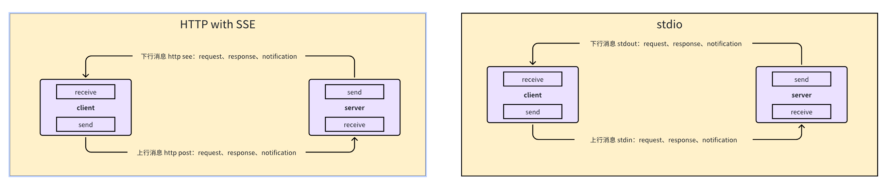
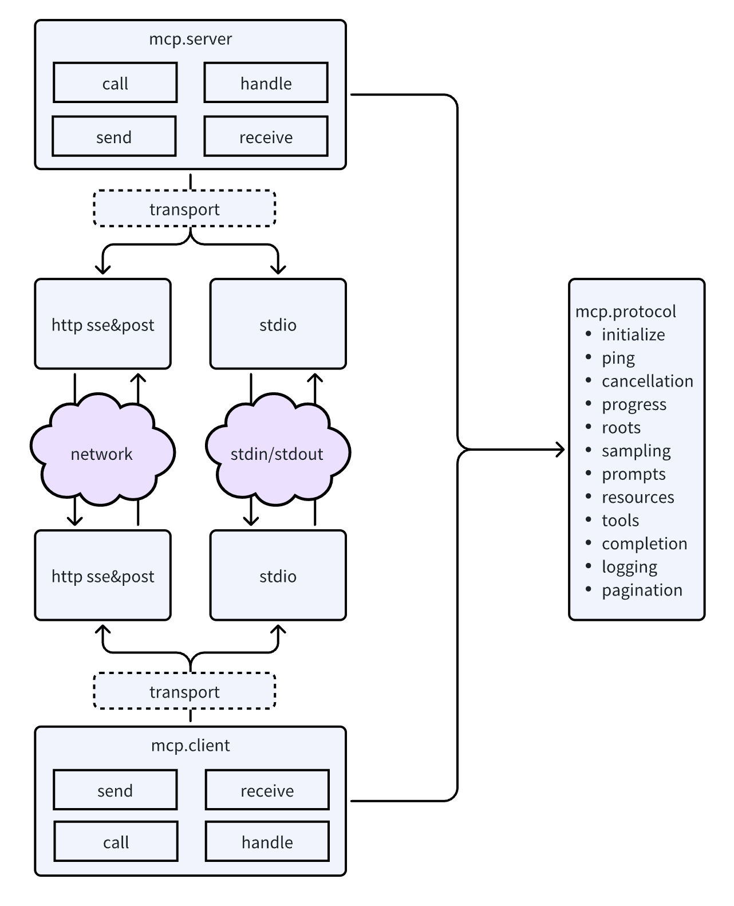

MCP Go SDK是一个功能强大且易于使用的Go语言客户端库，专为与Management Control Panel API进行交互而设计。该SDK提供了完整的API覆盖，包括资源管理、配置、监控和自动化操作等核心功能。

# 设计思路

- MCP 协议消息
    
    | 能力提供方        | 能力         | 协议消息 (客户端发送)                                      | 协议消息 (服务端发送)                                 |
    |-------------------|-------------|---------------------------------------------------|----------------------------------------------|
    | Client & Server   | **Ping**    | Ping                                              | Ping                                       |
    | Client & Server   | **Cancellation** | Cancelled Notifications                           | Cancelled Notifications                      |
    | Client & Server   | **Progress**     | Progress Notifications                            | Progress Notifications                       |
    | Client            | **roots**        | Root List Changes                                 | Listing Roots                                |
    | Client            | **sampling**     |                                                   | Creating Messages                            |
    | Server            | **prompts**      | Listing Prompts   Getting a Prompt            | List Changed Notification                    |
    | Server            | **resources**    | Listing Resources   Reading Resources   Resource Templates   Subscriptions: Request | List Changed Notification   Subscriptions: Update Notification |
    | Server            | **tools**        | Listing Tools   Calling Tools               | List Changed Notification                  |
    | Server            | **Completion**   | Requesting Completions                            |                                              |
    | Server            | **logging**      | Setting Log Level                                 | Log Message Notifications                  |

- 交互细节

  - 客户端和服务端都需要具备收发功能；
  - 可以将消息类型抽象为 message，具体实现包括 request、response、notification 三种；
  - 可以将架构抽象为三层传输层、协议层、用户层（server、client）

- 设计思想
  - 协议层与传输层通过 transport 接口进行解耦；
  - protocol 层完成 MCP 协议相关的全部定义，包括数据结构定义、请求结构构造、响应结构解析；
  - server 层与 client 层都具备发送(send)和接收(receive)的能力，发送能力包括发送 message(request、response、notification) 请求和响应的匹配 ，接收能力包括对 message(request、response、notification) 的路由、异步/同步处理；
  - server 层与 client 层实现对 request 和 response 的组合，用户侧使用时表现为同步请求、同步处理、同步返回。

# 架构设计

# 项目目录

    - transports
        - see
            - client.go
            - server.go
        - stdio
            - client.go
            - server.go
        - transport.go // transport 接口定义
      - protocol // 放置 mcp 协议相关的全部定义，包括数据结构定义、请求结构构造、响应结构解析；
          - initialize.go
          - ping.go
          - cancellation.go
          - progress.go
          - roots.go
          - sampling.go
          - prompts.go
          - resources.go
          - tools.go
          - completion.go
          - logging.go
          - pagination.go
      - server
          - send.go // 向客户端发送 message(request、response、notification)
          - receive.go // 对来自客户端的 message(request、response、notification)进行接收处理
          - route.go // 将收到的 message(request、notification) 路由到对应 handler 进行处理
          - handler.go // 对 message(request、notification) 进行处理，返回或不返回 response
      - client
          - send.go // 向服务端发送 message(request、response、notification)
          - receive.go // 对来自客户端的 message(request、response、notification)进行接收处理
          - route.go // 将收到的 message(request、notification) 路由到对应 handler 进行处理
          - handler.go // 对 message(request、notification) 进行处理，返回或不返回 response